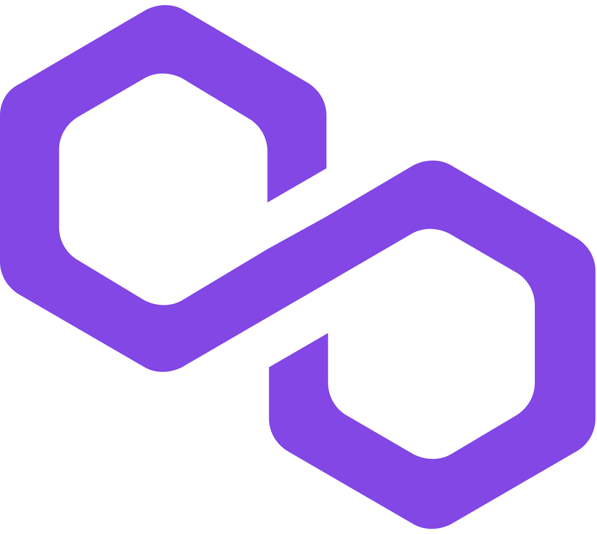

    
    
    
    
    
    
    
    

    <h1>Decent Airdrop DApp</h1>
    <h3>Effortless & Decentralized Airdrops Across Blockchains</h3>

    

---

## 🌟 **Project Description**

**Decent Airdrop DApp** is a powerful decentralized tool that enables users to **airdrop tokens** and **native crypto assets** across multiple wallets **with just a few clicks.** Designed for seamless blockchain interoperability, it currently supports **Optimism, Polygon, and Ethereum**.

🔹 **Easily distribute tokens** across multiple recipients  
🔹 **Supports multiple blockchain networks** and auto-detects the correct contract  
🔹 **Secures transactions with MetaMask**  
🔹 **Integrated contract UI for effortless execution**  
🔹 **Decentralized UI hosted on IPFS (soon! 🚀)**  

Your **Decent Airdrop DApp** provides a **trustless, decentralized way** to distribute rewards, promotional tokens, or payments to users. Whether you're an **NFT project, DAO, or community organizer**, this DApp makes bulk transactions effortless.  

---

## 🚀 **Features**

✅ **Multi-Chain Support** – Works on **Optimism, Polygon, Ethereum**  
✅ **Gas Optimized** – Executes transactions efficiently, reducing fees  
✅ **Custom Token & Native Coin Support** – Airdrop **ERC-20 tokens or ETH/MATIC**  
✅ **MetaMask Integration** – Easily connect and execute transactions  
✅ **Secure Transactions** – No middlemen, only smart contract interactions  

---

## 🏗 **How It Works**
1️⃣ **Connect your MetaMask wallet**  
2️⃣ **Select the blockchain** (Optimism, Polygon, or Ethereum)  
3️⃣ **Enter wallet addresses & airdrop amounts**  
4️⃣ **Choose a token (or use native currency like ETH/MATIC)**  
5️⃣ **Click "Send Airdrop" to execute the contract!**  
6️⃣ **Track the transaction in the blockchain explorer**  

---

## 🛠️ **Technologies Used**
-  **MetaMask**
-  **Solidity Smart Contracts**
-  **Node.js**
-  **IPFS**
-  **Decent Smart Home Ecosystem**

---

## 📅 **Milestones**
### ✅ **Achieved**
- **🚀 Multi-chain contract deployment**  
- **📡 Auto-chain detection & contract selection**  
- **⚡ Integrated Airdrop logic with UI**  
- **🔗 ERC-20 Token Approval System**  
- **🎨 Beautiful and Intuitive UI/UX**  

### 🚧 **Upcoming**
- **📡 Expand to more chains (Arbitrum, zkSync, Base)**  
- **🔗 Decentralized Frontend Hosting via IPFS**  
- **🛠 DAO & Community Airdrop Modes**  
- **📈 Advanced Analytics & Airdrop Tracking**  

---

## 🔗 **Blockchain Contract Addresses**
| Network | Contract Address |
|---------|----------------|
| **Ethereum** | `0x??????????????????????????????????????` |
| **Optimism** | `0x48Fa7CC60950783820c22392c6F9127cd4eA30f9` |
| **Polygon** | `0x64717B442c6ff1F2f71da09e11ABa7946EE4C5FD` |

---

## 🤝 **Contributing**
We **welcome contributions!** If you’d like to add features or improve the project, follow these steps:
1️⃣ Fork the repo  
2️⃣ Create a feature branch  
3️⃣ Submit a pull request  

---

## 📞 **Contact**
📩 **Email:** [decentairdrop@protonmail.com](mailto:decentairdrop@protonmail.com)  
🌐 **Website:** [Coming Soon 🚀]  

---

    
    
    
    
    
    
    
    
     
    Keep Your Transactions **Decent**!

